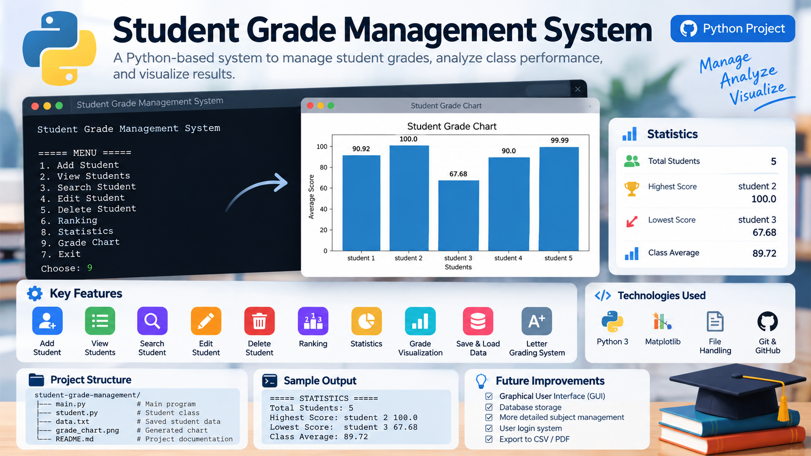
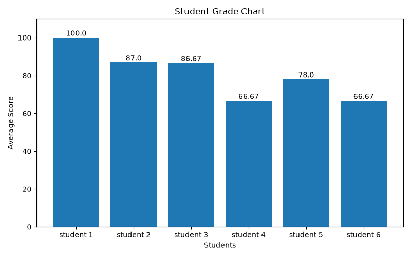

# Student Grade Management System

A Python-based student grade management system that allows users
to manage student records, calculate grades, analyze class performance,
and visualize student results.

## Features

- Add students
- View student records
- Search students
- Edit student grades
- Delete students
- Calculate average grades
- Letter grading system
- Student ranking
- Save and load student data
- Class statistics
- Grade visualization with Matplotlib

## Technologies

- Python 3
- Object-Oriented Programming
- File Handling
- Matplotlib
- Git & GitHub

## Data Analysis

The system can calculate:

- Total number of students
- Highest score
- Lowest score
- Class average

## Data Visualization

The system generates a bar chart to visualize student performance.

## Future Improvements

- Graphical User Interface (GUI)
- Database storage
- More detailed subject management
- User login system

## Author

Jinhao 